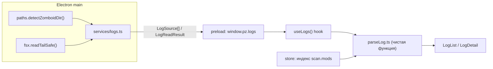

# План внедрения модуля **Ledger — Log Reader** (модуль 09)

План детального внедрения читателя логов Project Zomboid в PZ Management. Модуль
операционализирует твою заметку `Modding_Tools_B42.md` (console.txt, папка `Logs/`,
«читай первые строки при падении») и «расшивает» уже нарисованную, но запечатанную
плитку `ledger`.

> **Область первой версии (MVP):** только чтение логов. Никакой записи на диск,
> никаких новых прав в guard, ноль новых runtime-зависимостей. Половина «settings»
> модуля Ledger в этот план не входит (см. §14).

Ссылки на код даются в формате `путь:строка`, актуальном на момент написания.

---

## 1. Что делает модуль

| Возможность | Описание |
|---|---|
| Источники логов | `Zomboid\console.txt` (текущая сессия) + все `Zomboid\Logs\*.txt` (архив по датам), новейшие сверху |
| Чтение «хвоста» | Показывает последние N КБ файла (лог может быть в мегабайты) — быстро и без загрузки всего файла |
| Разбор на инциденты | Строки группируются: `ERROR`/`WARN`/`LOG`/`DEBUG`, Lua/Java стек-трейсы сворачиваются в один разворачиваемый пункт |
| «Первая ошибка» | Первый `error`/`exception` подсвечивается и доступен одним кликом (пункт №1 твоей заметки) |
| Линковка с модом | Токен пути/id мода в трейсе сопоставляется с индексом последнего скана → «показать мод в Explorer / скопировать id» |
| Фильтры и поиск | Чипы по уровню (error/warn/info/debug) со счётчиками + fuzzy-поиск по тексту |
| Действия по файлу | Reveal in Explorer / Open / Copy path — через уже существующие `shell:*` каналы |

**Не входит в MVP:** редактирование логов, «живой» tail в реальном времени
(опрос mtime — см. §14), переход прямиком к моду в Stalker, настройки приложения.

---

## 2. Почему это дёшево (карта переиспользования)

| Нужно | Уже есть в репозитории |
|---|---|
| Найти папку Zomboid | `detectZomboidDir()` — `src/main/services/paths.ts:71` |
| Право на чтение console.txt/Logs | `allowedRoots()` уже включает `zomboidDir` — `src/main/services/paths.ts:206`; guard пропустит чтение без изменений |
| Паттерн «opaque id, путь резолвит main» | `loadout.ts` (`listLoadoutFiles`, `SAFE_SERVER_NAME`) — `src/main/services/loadout.ts:113` |
| Безопасное чтение файла | `readTextSafe`/`readdirSafe`/`exists` — `src/main/services/fsx.ts:41` |
| Виртуализация длинных списков | `useVirtual` — `src/renderer/src/lib/useVirtual.ts:16` |
| Fuzzy-поиск + подсветка совпадений | `fuzzyMatch`/`segmentByIndices` — `src/renderer/src/lib/format.ts:44` |
| Подсветка синтаксиса (для стека) | `highlight` — `src/renderer/src/lib/highlight.ts:39` |
| Индекс модов (линковка) | `scan.mods`, `byKey`, `byModId` в сторе — `src/renderer/src/state/store.tsx:91` |
| Каркас модуля (тулбар/панели/статусбар/хоткеи) | `modules/loadout/Loadout.tsx` — `src/renderer/src/modules/loadout/Loadout.tsx` |
| Плитка и i18n-ключи | `ledger` уже описан — `src/renderer/src/hub/modules.ts:101`, `dict.ts:71` |

---

## 3. Архитектурное решение

**Где парсить?** В рендерере. Main остаётся тонким (как `loadout.files()`): резолвит
источники и отдаёт «хвост» текста. Рендерер владеет отображением, фильтрами, fuzzy,
виртуализацией и i18n — и именно там уже лежит индекс модов для линковки. Это
избавляет от повторных IPC при смене фильтра и держит `types.ts` компактным.

**Безопасность через opaque id.** Как в Loadout, рендерер **не передаёт путь**. Он
шлёт непрозрачный id (`console` или `log:<имяФайла>`), а main сам собирает путь от
`detectZomboidDir()`. Имя файла принимается, только если оно (а) проходит строгий
регэксп без разделителей/`..` и (б) реально присутствует в перечислении `Logs/`,
сделанном самим main. Для `Reveal/Open` рендерер использует уже безопасные каналы
`shell:reveal`/`shell:open`, которые прогоняют путь через `assertPathAllowed`.



---

## 4. Контракты (`src/shared/*`) — без зависимостей от node/electron

### 4.1 `src/shared/types.ts` — добавить в конец файла

```ts
/* =========================================================================
   Ledger (module 09) — log reader (read-only)
   ========================================================================= */

export type LogKind = 'console' | 'log'

/** Один файл лога, который модуль может показать. Путь резолвит main. */
export interface LogSource {
  /** Непрозрачный селектор для `log:read`: `console` или `log:<file>`. */
  id: string
  kind: LogKind
  /** Имя для UI: `console.txt` или имя файла из папки Logs. */
  name: string
  /** Абсолютный путь — только для reveal/open через shell:* каналы. */
  path: string
  exists: boolean
  size: number
  mtime: number
}

/** Прочитанный «хвост» одного лога. */
export interface LogReadResult {
  id: string
  path: string
  /** Текст (хвост до предела LOG_TAIL_MAX). */
  text: string
  /** Полный размер файла на диске. */
  size: number
  mtime: number
  /** true, если начало файла отброшено (показан только хвост). */
  truncated: boolean
}
```

### 4.2 `src/shared/ipc.ts` — добавить в объект `IPC` (после `loApply`, `ipc.ts:41`)

```ts
  /* Ledger — read-only log reader; main resolves the paths itself. */
  logList: 'log:list',
  logRead: 'log:read'
```

### 4.3 `src/shared/api.ts` — импорт типов + новая секция в `PzApi` (после `loadout`, `api.ts:96`)

```ts
  /**
   * Read-only log reader. Like Loadout it never accepts a renderer path — the
   * renderer sends an opaque source id and main resolves it from the detected
   * Zomboid user directory.
   */
  logs: {
    /** console.txt + every Logs\*.txt, newest first. */
    list(): Promise<LogSource[]>
    /** Read the tail of one source by its opaque id. */
    read(id: string): Promise<LogReadResult>
  }
```

---

## 5. Main-процесс

### 5.1 `src/main/services/fsx.ts` — новый хелпер чтения хвоста

`readTextSafe` (`fsx.ts:81`) читает **от начала** файла. Логи растут с конца, поэтому
нужен парный хелпер, читающий последние `maxBytes`:

```ts
/** Читает последние `maxBytes` файла (для растущих логов). Партиальную первую
 *  строку отбрасываем, чтобы не показать обрезок. */
export async function readTailSafe(
  p: string,
  maxBytes = 1024 * 1024
): Promise<{ text: string; size: number; mtime: number; truncated: boolean } | undefined> {
  try {
    const handle = await fs.open(p, 'r')
    try {
      const st = await handle.stat()
      const len = Math.min(st.size, maxBytes)
      const start = st.size - len
      const buf = Buffer.alloc(len)
      await handle.read(buf, 0, len, start)
      let text = stripBom(buf.toString('utf8'))
      if (start > 0) {
        const nl = text.indexOf('\n')
        if (nl >= 0) text = text.slice(nl + 1)
      }
      return { text, size: st.size, mtime: st.mtimeMs, truncated: start > 0 }
    } finally {
      await handle.close()
    }
  } catch {
    return undefined
  }
}
```

### 5.2 `src/main/services/logs.ts` — новый сервис

```ts
import { join } from 'node:path'
import type { AppSettings, LogReadResult, LogSource } from '../../shared/types'
import { exists, readdirSafe, readTailSafe } from './fsx'
import { detectZomboidDir } from './paths'

const CONSOLE_REL = 'console.txt'
const LOGS_DIR = 'Logs'
const LOG_TAIL_MAX = 1024 * 1024 // 1 MiB хвоста

/** Разрешённое имя файла в Logs: без разделителей и `..`. */
const SAFE_LOG_NAME = /^[\w.\-]+\.txt$/i

export async function listLogSources(settings: AppSettings): Promise<LogSource[]> {
  const zomboidDir = await detectZomboidDir(settings)
  if (!zomboidDir) return []
  const out: LogSource[] = []

  const consolePath = join(zomboidDir, CONSOLE_REL)
  out.push({
    id: 'console',
    kind: 'console',
    name: CONSOLE_REL,
    path: consolePath,
    exists: await exists(consolePath),
    size: 0,   // при желании — дозаполнить stat-ом; для списка не критично
    mtime: 0
  })

  const logsDir = join(zomboidDir, LOGS_DIR)
  const entries = (await readdirSafe(logsDir))
    .filter((e) => e.isFile() && e.name.toLowerCase().endsWith('.txt'))
    .map((e) => e.name)
    .sort((a, b) => b.localeCompare(a, undefined, { numeric: true, sensitivity: 'base' }))
  for (const name of entries) {
    out.push({
      id: `log:${name}`,
      kind: 'log',
      name,
      path: join(logsDir, name),
      exists: true,
      size: 0,
      mtime: 0
    })
  }
  return out
}

export async function readLog(settings: AppSettings, id: string): Promise<LogReadResult> {
  const zomboidDir = await detectZomboidDir(settings)
  if (!zomboidDir) throw new Error('Zomboid user directory not found')

  let path: string
  if (id === 'console') {
    path = join(zomboidDir, CONSOLE_REL)
  } else if (id.startsWith('log:')) {
    const name = id.slice(4)
    if (!SAFE_LOG_NAME.test(name)) throw new Error(`Refusing log name "${name}"`)
    // Вторая линия обороны: имя должно реально присутствовать в перечислении Logs.
    const known = (await readdirSafe(join(zomboidDir, LOGS_DIR))).some((e) => e.name === name)
    if (!known) throw new Error(`Unknown log: ${name}`)
    path = join(zomboidDir, LOGS_DIR, name)
  } else {
    throw new Error(`Unknown log source: ${id}`)
  }

  const tail = await readTailSafe(path, LOG_TAIL_MAX)
  if (!tail) throw new Error(`Cannot read log: ${path}`)
  return { id, path, text: tail.text, size: tail.size, mtime: tail.mtime, truncated: tail.truncated }
}
```

> Опция: заполнять `size`/`mtime` в `listLogSources` через `fs.stat` (для сортировки
> по свежести и отображения размера). Это можно сделать лениво (батч `pLimit`), но для
> MVP список маленький и `stat` каждого файла тривиален.

### 5.3 `src/main/ipc.ts` — регистрация (внутри `registerIpc`, после блока Loadout, `ipc.ts:258`)

```ts
import { listLogSources, readLog } from './services/logs'
// ...
  // --- Ledger (module 09): read-only log reader --------------------------
  ipcMain.handle(IPC.logList, async () => listLogSources(await getSettings()))
  ipcMain.handle(IPC.logRead, async (_e, id: string) => readLog(await getSettings(), id))
```

Guard не требуется: путь строит main, а не рендерер. Записи нет — `invalidateGuard()`
вызывать не нужно.

---

## 6. Preload (`src/preload/index.ts`) — секция после `loadout` (`index.ts:71`)

```ts
  logs: {
    list: () => ipcRenderer.invoke(IPC.logList),
    read: (id: string) => ipcRenderer.invoke(IPC.logRead, id)
  }
```

---

## 7. Renderer

### 7.1 Активировать плитку — `src/renderer/src/hub/modules.ts:108`

```ts
    status: 'live'   // было 'sealed'
```

Ключи `module.ledger.tagline` / `module.ledger.desc` уже есть (`dict.ts:71`).
Иконка `book` уже используется тайлом (`Icon.tsx:57`).

### 7.2 Подключить вид — `src/renderer/src/App.tsx`

```tsx
import { Ledger } from './modules/ledger/Ledger'   // рядом со строкой 8
// ...
{view === 'ledger' ? <Ledger onExit={goHome} /> : null}   // после строки 52
```

### 7.3 Хук данных — `src/renderer/src/modules/ledger/useLogs.ts` (новый)

Зеркалит `useLoadout` (`useLoadout.ts:95`): загрузка `list()`, выбор источника,
чтение `read(id)`, состояния `loading`/`error`, `reload()`.

```ts
export interface LogStore {
  sources: LogSource[]
  sourceId: string
  source: LogSource | undefined
  select(id: string): void
  content: LogReadResult | undefined
  loading: boolean
  error: string | undefined
  reload(): Promise<void>   // перечитать текущий источник (F5)
}
```

Поведение: при первом рендере `list()`; по умолчанию выбирается `console`; при смене
`sourceId` — `read(id)`. Гонки чтения гасить счётчиком `run.current` (как `useMapFolders`,
`useLoadout.ts:210`).

### 7.4 Парсер — `src/renderer/src/modules/ledger/parseLog.ts` (новый, чистая функция)

Вход: текст хвоста + индекс модов. Выход: массив инцидентов. Тестируемо в изоляции.

```ts
export type LogLevel = 'error' | 'warn' | 'info' | 'debug'

export interface LogIncident {
  id: number
  level: LogLevel
  line: number       // 1-based номер строки в хвосте
  head: string       // первая строка
  body: string[]     // продолжение/стек
  modKey?: string    // ModEntry.key, если удалось слинковать
  modId?: string
}

export interface ModIndex {
  byFolder: Map<string, { key: string; modId?: string }>  // folderName.toLowerCase()
  ids: Array<{ id: string; key: string }>                 // modId для поиска в тексте
}

export function buildModIndex(mods: ModEntry[]): ModIndex { /* из scan.mods */ }
export function parseLog(text: string, index: ModIndex): LogIncident[] { /* см. §8 */ }
```

### 7.5 UI — `src/renderer/src/modules/ledger/Ledger.tsx` (+ `LogList.tsx`, опц. `LogDetail.tsx`)

Компоновка повторяет Loadout (тулбар + панели + статусбар), переиспользуя классы
`toolbar`, `wbseg`, `pane`, `statusbar`, `btn`, `Splitter`, `Hint`, `Icon`, `useToast`.

- **Тулбар (верх):** `Hub`-кнопка → сегментный `wbseg` выбора источника (Console + файлы
  Logs) → спейсер → чипы уровней (error/warn/info/debug со счётчиками) → тумблер
  «Только ошибки» → `Reveal`/`Open`/`Copy path` → кнопка reload.
- **Тулбар (низ):** поле fuzzy-поиска (как `tb.searchPlaceholder`).
- **Левая/центральная панель:** виртуализированный список инцидентов (`useVirtual`,
  фикс. высота строки, `overscan 12`). Каждая строка: глиф уровня (иконки `alert` /
  `alert-circle` / `info`), номер строки, свёрнутый заголовок с подсветкой fuzzy
  (`segmentByIndices` + `<mark>`), бейдж слинкованного мода.
- **Правая панель (опц., MVP-минимум — разворот строки):** полный стек выбранного
  инцидента через `highlight(text, 'lua')`, и блок мода со ссылками
  `Reveal in Explorer` (`window.pz.shell.reveal(mod.path)`) / `Copy mod id`.
- **Статусбар:** `errors N · warns N · размер (formatBytes(size)) · truncated? · путь
  (shortenPath)`.
- **Хоткеи:** `F5` — reload источника; `Ctrl+F` — фокус поиска; `Esc` — на хаб
  (обрабатывается уже в `App.tsx:23`).

### 7.6 Стили — `src/renderer/src/styles/ledger.css` (новый) + импорт

`src/renderer/src/main.tsx` после строки 9:

```ts
import './styles/ledger.css'
```

Держать тонким: переиспользовать токены из `theme.css` и общие классы; добавить только
`.led__row`, `.led__lvl--error/warn/info`, `.led__mod`, стиль развёрнутого стека.

### 7.7 i18n — `src/renderer/src/i18n/dict.ts`

`EN` — источник истины, `RU: Record<TKey,string>` (`dict.ts:812`) — пропуск ключа даёт
**ошибку компиляции**. Добавить namespace `led.*` в оба словаря, например:

```ts
  // ---- ledger (module 09) -------------------------------------------------
  'led.source': 'Log',
  'led.console': 'Console (current session)',
  'led.reload': 'Reload',
  'led.reloadTitle': 'Re-read this log (F5)',
  'led.onlyErrors': 'Errors only',
  'led.search': 'Search log text…',
  'led.reveal': 'Reveal in Explorer',
  'led.copyPath': 'Copy path',
  'led.noUserDir': 'Zomboid user directory not found',
  'led.noLogs': 'No logs found',
  'led.empty': 'This log is empty',
  'led.truncated': 'showing last {bytes}',
  'led.lvlError': 'Errors',
  'led.lvlWarn': 'Warnings',
  'led.jumpMod': 'Reveal mod in Explorer',
  'led.sbErrors': '{n} errors',
  'led.sbWarns': '{n} warnings',
  // help.* при использовании Hint
```

Опционально — новые plural-ключи в `EN_PLURALS` (`dict.ts:1582`) и `RU_PLURALS`
(`dict.ts:1596`), с сохранением тройной формы:

```ts
  errors: ['error', 'errors', 'errors'],
  lines:  ['line', 'lines', 'lines']
// RU: ['ошибка','ошибки','ошибок'], ['строка','строки','строк']
```

---

## 8. Эвристики разбора логов PZ (в `parseLog.ts`)

Парсер строится на реальных форматах PZ. Правила (порядок важен):

1. **Уровень строки.** Префикс PZ: `^(LOG|DEBUG|WARN|ERROR|FATAL)\s*:` → маппинг в
   `debug|warn|error`. Плюс мягкие сигналы без префикса: `exception`, `stack trace`,
   `attempted to (call|index)`, `a nil value`, `java\.[\w.]+Exception`, `Caused by:`
   → `error`.
2. **Границы инцидента.** Новый инцидент начинается на строке с уровнем `warn`/`error`
   (или на строке-сигнале). Последующие строки-продолжения присоединяются в `body`,
   пока не встретится следующая размеченная/таймстемпнутая строка. Признаки
   продолжения: начало с пробелов/таба, `at `, `java.`, `function:`, `[File "..."`,
   разделители `-----`, `callframe`, `\tat`.
3. **Свёртка стека.** Весь Java/Lua стек одного исключения — один разворачиваемый
   инцидент; заголовок = первая содержательная строка исключения.
4. **Линковка с модом.** Для заголовка и `body` искать:
   - подстроку `\bmods[\\/]<Folder>\b` или `[\\/]<Folder>[\\/]media[\\/]` →
     `index.byFolder.get(folder)`;
   - любой известный `modId` из `index.ids` как отдельный токен.
   Первое совпадение выигрывает; в инциденте храним `modKey`/`modId`.
5. **«Первая ошибка».** UI отдельно помечает первый инцидент уровня `error` (быстрый
   скролл к нему кнопкой) — прямая реализация пункта №1 заметки.

> Эвристика намеренно консервативна (как Lua-лексер валидатора): лучше не разметить
> строку, чем ложно назвать её ошибкой. Правила — данные, их легко расширять.

---

## 9. Безопасность (сверка с моделью проекта)

- **Только чтение.** Ни один новый путь не пишется; write-allowlist и `assertPathWritable`
  не затрагиваются.
- **Пути строит main.** Рендерер шлёт `console` / `log:<file>`; `<file>` проходит
  `SAFE_LOG_NAME` **и** должен присутствовать в реальном перечислении `Logs/`. Это
  тот же принцип, что у `applyLoadout` с `SAFE_SERVER_NAME` (`loadout.ts:36`).
- **Reveal/Open** идут через существующие `shell:reveal`/`shell:open`, которые уже
  прогоняют путь через `assertPathAllowed`, а `shell:open` ещё и отказывается запускать
  ~50 исполняемых расширений (`ipc.ts:36`). Логи — `.txt`, попадают под безопасный путь.
- **Без exec, без внешних URL** из содержимого лога.

---

## 10. Производительность

- **Хвост, а не весь файл.** `LOG_TAIL_MAX = 1 MiB` (настраиваемая константа). Один
  `stat` + одно частичное чтение.
- **Виртуализация.** `useVirtual` держит десятки тысяч строк на нативной скорости.
- **Парсинг один раз на загрузку.** `parseLog` вызывается при получении `content`
  (`useMemo` по `content.text` + индексу). Фильтр/поиск работают над уже разобранным
  массивом без повторного IPC.
- **Fuzzy по инцидентам.** `fuzzyMatch` достаточно быстр для тысяч строк на нажатие
  (как в Stalker по ~1000 модов).

---

## 11. Пошаговый план внедрения (фазы)

| # | Фаза | Файлы | Проверка |
|---|---|---|---|
| 1 | Контракты | `shared/types.ts`, `shared/ipc.ts`, `shared/api.ts` | `npm run typecheck` |
| 2 | Main: чтение хвоста + сервис | `main/services/fsx.ts`, `main/services/logs.ts` | typecheck:node |
| 3 | Main: регистрация IPC | `main/ipc.ts` | typecheck:node |
| 4 | Preload | `preload/index.ts` | typecheck |
| 5 | Активация плитки + вид | `hub/modules.ts`, `App.tsx` | плитка `ledger` кликается |
| 6 | Хук + парсер | `modules/ledger/useLogs.ts`, `modules/ledger/parseLog.ts` | typecheck:web |
| 7 | UI + стили | `modules/ledger/Ledger.tsx`, `LogList.tsx`, (`LogDetail.tsx`), `styles/ledger.css`, `main.tsx` | ручной прогон |
| 8 | i18n (EN+RU, плюрали) | `i18n/dict.ts` | typecheck (Record<TKey> ловит пропуски) |
| 9 | Полировка | — | сценарии §12 |

**Итог по объёму:** ~4 новых файла в рендерере + 1 сервис в main + 1 CSS; правки в
9 существующих файлах. Сравнимо с модулем Loadout, но проще (нет записи и профилей).

---

## 12. План проверки

**Автоматический гейт:** `npm run typecheck` (единственный обязательный, см. README).
`RU: Record<TKey,string>` гарантирует, что каждый `led.*` ключ переведён.

**Ручные сценарии (`npm run dev`):**
1. Плитка `ledger` → «Online», открывается, показывает `console.txt` по умолчанию.
2. Нет папки Zomboid → аккуратный `Alert` (`led.noUserDir`), без падения.
3. Пустой `console.txt` → `led.empty`; большой (>1 MiB) → бейдж `truncated`.
4. Сгенерировать ошибку: запустить игру с битым модом или с `-debug`, уронить Lua →
   в `console.txt`/`Logs` появляется трейс → он свёрнут в один инцидент, уровень
   `error`, кликом разворачивается стек.
5. Линковка: строка с `mods\<Folder>\media\lua\...` → бейдж мода → Reveal открывает
   Explorer на папке мода.
6. Фильтр «Только ошибки» и fuzzy-поиск сокращают список и подсвечивают совпадения.
7. `F5` перечитывает файл; смена источника в `wbseg` мгновенна.
8. Переключение языка EN/RU не ломает подписи.

---

## 13. Крайние случаи и риски

- **Файл занят игрой.** PZ дописывает `console.txt` во время работы. Частичное чтение
  снимка безопасно; при желании — авто-обновление по mtime (см. §14).
- **Кодировка.** Логи PZ — UTF-8; `stripBom` уже применяется. Экзотических кодировок не
  ожидаем.
- **Обрезанный хвост.** Первая строка хвоста может быть неполной — отбрасываем её
  (см. `readTailSafe`) и показываем бейдж `truncated`.
- **Старый скан для линковки.** Если скан пуст/устарел, линковка мягко отсутствует
  (инцидент показывается без бейджа) — не ошибка.
- **CRLF.** Логи Windows содержат `\r\n`; парсер бьёт по `/\r?\n/` (как `loadout.ts`).

---

## 14. Будущие расширения (после MVP)

- **Живой tail:** опрос `mtime` через `background_process`/интервал и дочитывание конца
  файла; тумблер «Follow».
- **Переход в Stalker:** добавить в `App.tsx` начальный выбор мода, чтобы бейдж
  открывал мод в Stalker (сейчас — Reveal/Copy).
- **Синергия с Triage (модуль 05):** повторяющиеся сигнатуры ошибок конкретного мода —
  вход для «conflict doctor».
- **Вторая половина Ledger (settings):** UI для `disabledSources`/`customSources`/
  overrides, которые сканер уже читает, но UI нет (README «Known limitations»).
- **Экспорт инцидента:** копирование свёрнутого стека одной кнопкой (`copyText`,
  `format.ts:114`).

---

## 15. Сводка изменений по файлам

**Новые:**
- `src/main/services/logs.ts`
- `src/renderer/src/modules/ledger/useLogs.ts`
- `src/renderer/src/modules/ledger/parseLog.ts`
- `src/renderer/src/modules/ledger/Ledger.tsx`
- `src/renderer/src/modules/ledger/LogList.tsx`
- `src/renderer/src/modules/ledger/LogDetail.tsx` *(опционально)*
- `src/renderer/src/styles/ledger.css`

**Правки:**
- `src/shared/types.ts` (+`LogKind`/`LogSource`/`LogReadResult`)
- `src/shared/ipc.ts` (+`logList`/`logRead`)
- `src/shared/api.ts` (+`logs`)
- `src/main/services/fsx.ts` (+`readTailSafe`)
- `src/main/ipc.ts` (+2 хендлера, +импорт)
- `src/preload/index.ts` (+`logs`)
- `src/renderer/src/hub/modules.ts` (`ledger` → `live`)
- `src/renderer/src/App.tsx` (+ветка `ledger`)
- `src/renderer/src/main.tsx` (+импорт css)
- `src/renderer/src/i18n/dict.ts` (+`led.*` в EN и RU, +плюрали)

**Гарантии:** ноль новых runtime-зависимостей; только чтение; guard/allowlist без
изменений; единственный автоматический гейт — `npm run typecheck`.
